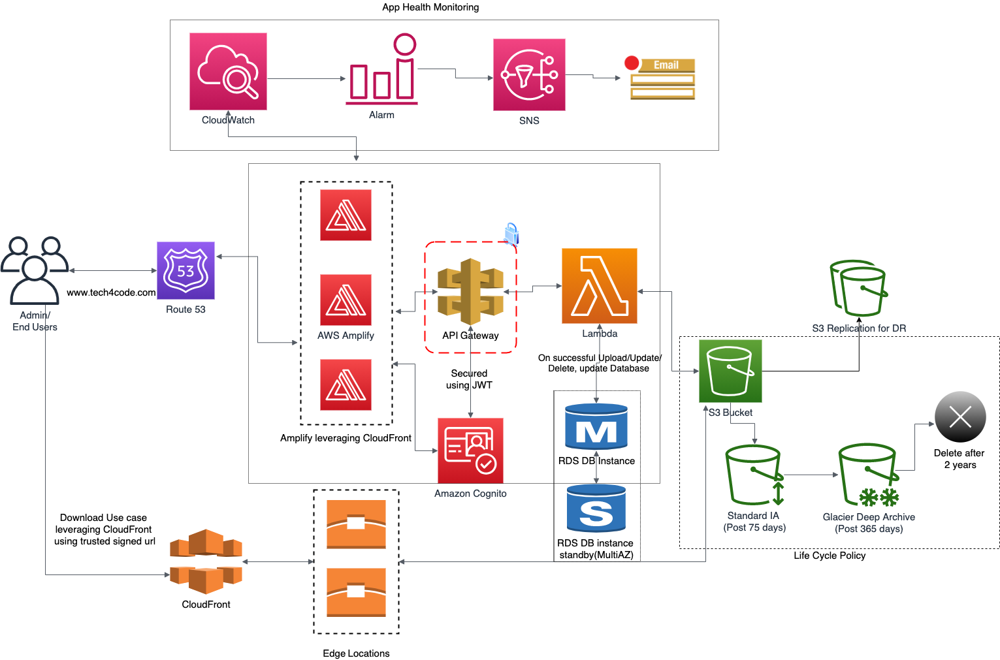

This is a cloud-native serverless web application using AWS for file storage. It is developed using AWS Amplify which builds and deploys the application. Frontend of this project was bootstrapped with [Create React App](https://github.com/facebook/create-react-app). Backend is using Expressjs framework.

The services used in this project are:
* Route53 for DNS service.
* AWS Cognito for authentication.
* Amplify for hosting application.
* S3 for storing files.
* CloudFront for faster downloads.
* API driven backend using API Gateway.
* Serverless app leveraging Lambda.
* Amaon RDS for user updates.
* CloudWatch and SNS for app health monitoring.
* CI/CD enabled with Github.
* Multi region repliation of S3 for Disaster Recovery.
* Multi AZ deployment of RDS DB Instance.

### Architecture Diagram

#### Features:
* A Cloud native application.
* CI/CD enabled with Github.
* Reduced latency using Amplify(leverages CloudFront).
* Disaster Recovery using replication of S3 bucket..
* Faster uploads using S3 Transfer Acceleration.
* Authentication using Amazon Cognito.
* App health check using CloudWatch and SNS.
* Provisioned Concurrency for Lambda(Scaling)
* Multi-AZ RDS Deployment.
* Optimized Cost storage using Life Cycle Policy.
